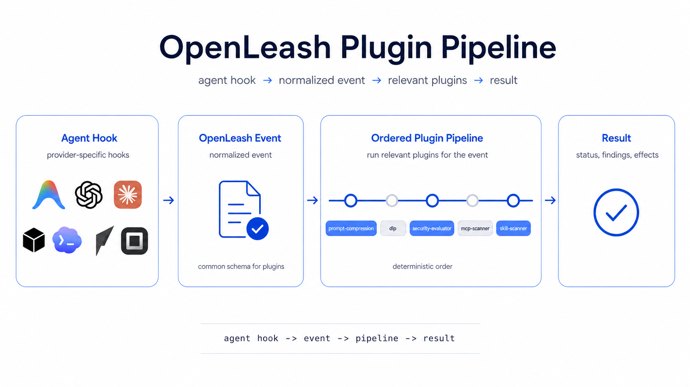

<div align="center">


<p>
  <a href="https://openleash.com"></a>
  <a href="https://docs.openleash.com"></a>
  <a href="https://github.com/open-leash/plugins"></a>
</p>

<p>
  
  
  
</p>

<h3>OpenLeash watches agent events, runs the right plugins, and returns the right decision or transformation.</h3>



</div>

---

## What OpenLeash Is

OpenLeash is an interception layer for AI agents.

An agent does something: submits a prompt, calls a tool, starts a session, changes a skill, produces a response, or touches an MCP server. OpenLeash catches that moment, normalizes it into an event, runs the plugins subscribed to that event, and returns a result when the agent needs one.

```text
agent action
  -> OpenLeash intercepts
  -> OpenLeash emits a normalized event
  -> matching plugins run in order
  -> OpenLeash returns allow, deny, ask, transformed prompt, inventory, audit, or metadata
```

That makes OpenLeash bigger than a security product. Security is one important use case, but the same pipeline also handles token compression, prompt shaping, MCP inventory, skill scanning, audit context, approvals, policy decisions, and future community-built agent features.

---

## Real Examples

```text
User submits a long prompt
  -> event: prompt.beforeSubmit
  -> prompt-compression reduces token cost
  -> dlp checks the final prompt
  -> security-evaluator decides whether to continue
```

```text
Agent calls a tool or MCP server
  -> event: tool.beforeUse
  -> security-evaluator checks policy
  -> mcp-scanner records inventory and audit context
  -> OpenLeash returns allow, ask, or deny
```

```text
OpenLeash detects a new agent skill
  -> event: skill.changed
  -> skill-scanner reviews the skill
  -> OpenLeash stores the finding or asks for review
```

```text
Agent finishes work
  -> event: agent.response
  -> response-aware plugins can evaluate output, add audit context, or trigger follow-up workflows
```

---

## Why It Exists

Agents are leaving the chat box.

They read repos, edit files, call tools, run shell commands, browse SaaS apps, touch tickets, inspect databases, interact with MCP servers, and work across local and cloud environments.

The hard problem is not only "block dangerous things." It is:

- What did the agent try to do?
- Which tools and MCP servers did it use?
- What context did it send?
- Which plugin changed or checked the request?
- Was a human asked?
- What should happen next?

OpenLeash is built to make those answers clear, programmable, and auditable.

---

## The Plugin Model

Plugins are small, focused features that subscribe to OpenLeash events.

Each plugin has:

- a manifest with name, version, events, permissions, settings, effects, and ordering
- a handler that receives event input
- stable capabilities for storage, model access, notifications, DLP, prompt compression, audit, and policy checks
- typed results that OpenLeash merges into the final agent response

Plugins do not import OpenLeash internals. They ask for capabilities and OpenLeash decides how those capabilities are fulfilled in OpenLeash Cloud or Private Cloud.

Start here: [`open-leash/plugins`](https://github.com/open-leash/plugins)

---

## First-Party Plugins

| Plugin | Event | What it does |
|---|---|---|
| [`prompt-compression`](https://github.com/open-leash/plugins/tree/main/plugins/prompt-compression) | `prompt.beforeSubmit` | Reduces prompt size before downstream checks. |
| [`dlp`](https://github.com/open-leash/plugins/tree/main/plugins/dlp) | `prompt.beforeSubmit` | Masks or blocks sensitive data in prompts. |
| [`security-evaluator`](https://github.com/open-leash/plugins/tree/main/plugins/security-evaluator) | prompts, tools, responses | Applies policy and can allow, deny, or ask. |
| [`mcp-scanner`](https://github.com/open-leash/plugins/tree/main/plugins/mcp-scanner) | `tool.beforeUse`, `tool.afterUse` | Inventories MCP tool usage for audit and review. |
| [`skill-scanner`](https://github.com/open-leash/plugins/tree/main/plugins/skill-scanner) | startup, agent detected, skill changed | Reviews agent skills and records findings. |

---

## Who It Is For

### Developers using coding agents

Use OpenLeash to understand and shape what agents do across prompts, tools, shell commands, files, MCP servers, and code workflows.

### Teams adopting agents at work

Use OpenLeash to configure plugins, route approvals, track usage, review audit history, and roll out agent controls through OpenLeash Cloud or Private Cloud.

### Security and platform teams

Use OpenLeash to make agent behavior visible and enforceable without banning the tools people actually want to use.

### Plugin builders

Build focused pipeline features: cost reducers, prompt transforms, approval workflows, MCP inventory plugins, policy packs, session analyzers, data classifiers, and more.

---

## Repository Map

| Repo | Purpose |
|---|---|
| [`main-web`](https://github.com/open-leash/main-web) | Product website. |
| [`docs-web`](https://github.com/open-leash/docs-web) | Public documentation site. |
| [`plugins`](https://github.com/open-leash/plugins) | First-party plugins, examples, and plugin builder docs. |
| [`shared`](https://github.com/open-leash/shared) | Shared TypeScript contracts and event/plugin types. |
| [`desktop-client`](https://github.com/open-leash/desktop-client) | Installed desktop app, tray, local relay API, and hook installer. |
| [`client-api`](https://github.com/open-leash/client-api) | Client-facing API for hooks, plugin pipeline, evaluations, approvals, audit, enrollment, and updates. |
| [`dashboard-api`](https://github.com/open-leash/dashboard-api) | Admin API for organization setup, policy, users, plugin settings, audit, and usage. |
| [`dashboard-web`](https://github.com/open-leash/dashboard-web) | Admin/CISO dashboard for organizations. |
| [`mobile-client`](https://github.com/open-leash/mobile-client) | Mobile approval companion for existing OpenLeash users. |
| [`cloud-client-api`](https://github.com/open-leash/cloud-client-api) | Thin hosted wrapper around the public client API. |
| [`cloud-dashboard-api`](https://github.com/open-leash/cloud-dashboard-api) | Thin hosted wrapper around the public dashboard API. |
| [`cloud-dashboard-web`](https://github.com/open-leash/cloud-dashboard-web) | Thin hosted wrapper around the public dashboard web app. |

---

## Product Shape

OpenLeash has two backend-backed deployment paths:

- **OpenLeash Cloud**: hosted by OpenLeash for individuals and organizations.
- **Private Cloud**: customer-hosted open-source core for organizations that need their own API, dashboard, database, identity, logs, and operational controls.

The desktop client still receives local hooks first at `127.0.0.1`, but account state, plugin settings, policy, approvals, audit, and evaluation come from the configured backend.

---

## What We Believe

Agents should be useful, fast, and connected.

Humans should still understand what happened.

Teams should be able to adopt agents without turning every workflow into blind trust or blanket denial.

OpenLeash is the middle layer: observable, configurable, extensible, and open.

---

<div align="center">

### Start Here

<a href="https://openleash.com"></a>
<a href="https://docs.openleash.com"></a>
<a href="https://github.com/open-leash/plugins"></a>

<br/>
<br/>


</div>
